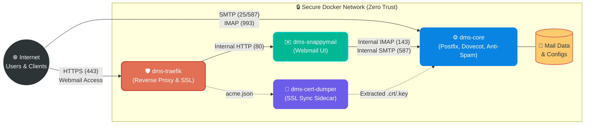
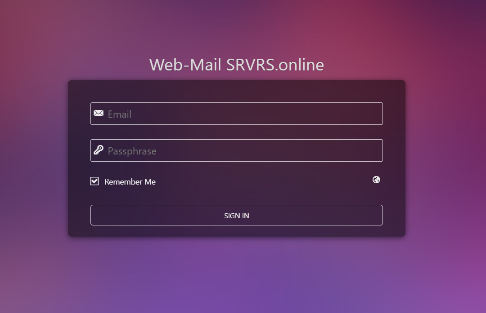
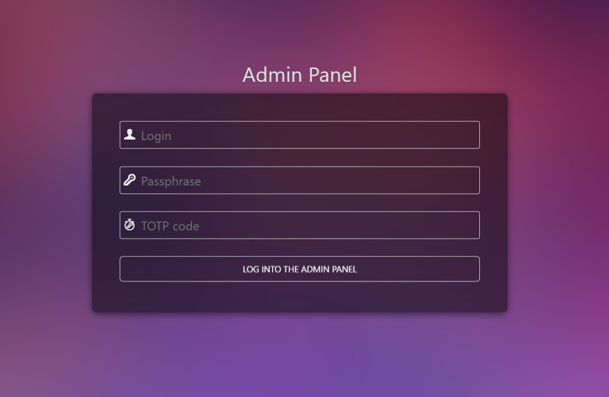
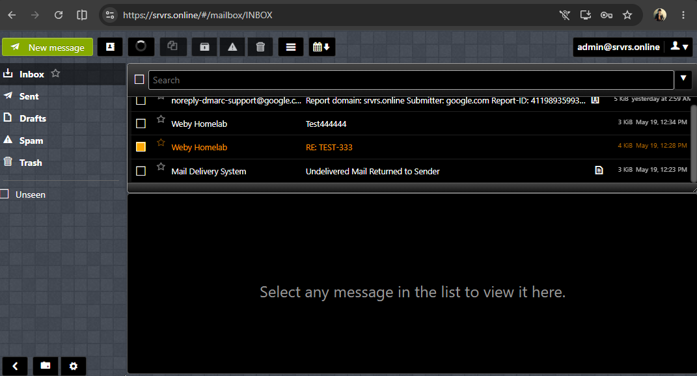
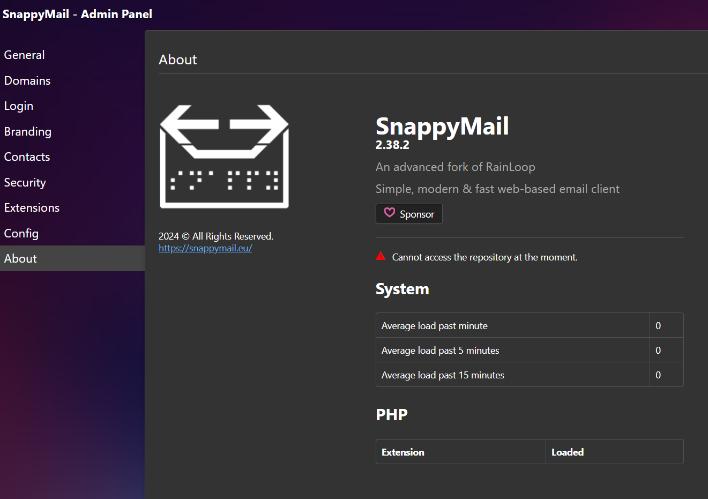

<div align="center">

# ✉️ Docker Mailserver GUI

**Full Stack Secure Deployment: `docker-mailserver` + Traefik + SnappyMail**

[](./SECURITY.md)
[-blue.svg)](https://debian.org)
[](https://traefik.io)
[](https://snappymail.eu)

A modern, highly secure implementation based on the official [docker-mailserver](https://github.com/docker-mailserver/docker-mailserver), tailored to provide a fully functional Web GUI out-of-the-box without compromising the strict security mandates of the original project.

</div>

---

## 🌟 Why This Project?

The original `docker-mailserver` is incredibly robust but intentionally lacks a graphical user interface (GUI) or database to minimize the attack surface. 

However, users often need a Webmail interface to check emails without configuring a desktop client. Attempting to force a Webmail client (like Roundcube or SOGo) into the same Docker container violates containerization best practices and introduces severe security risks.

**`docker-mailserver-gui` solves this by introducing a microservices-based, Zero Trust architecture.**

## ⚡ Key Advantages Over Standard docker-mailserver

While the upstream [docker-mailserver](https://github.com/docker-mailserver/docker-mailserver) is a stellar mail engine, deploying it with a web interface typically requires hours of manual integration, reverse proxy configuration, and certificate mapping. Here is how `docker-mailserver-gui` elevates the deployment experience:

| Feature / Aspect | Upstream `docker-mailserver` | `docker-mailserver-gui` Stack |
| :--- | :--- | :--- |
| **Web Mail Access** | ❌ CLI only. User must manually deploy and connect a webmail app. | ✉️ Ready-to-use, db-less SnappyMail client. |
| **SSL/TLS Sync** | ⚠️ Requires manual post-hook scripting or volume hacking to reload certs. | 🔄 Automated `cert-dumper` sidecar reloads postfix/dovecot on new certs. |
| **Network Security** | 🔓 Port exposure depends entirely on manual host rules. | 🔒 Isolated private Docker network. Webmail has no direct internet exposure. |
| **Reverse Proxy** | ❌ None. Manual SSL/HTTPS provisioning required. | 🛡️ Integrated Traefik v3 proxy with automatic Let's Encrypt. |
| **Persistence** | ⚠️ Anonymous webmail volumes easily lead to configuration loss. | 💾 Explicitly mapped, permission-hardened `./snappymail-data` directory. |
| **Default Credentials** | ⚠️ Supervisor UNIX socket relies on fallback default passwords. | 🚫 Strictly enforced **Zero Fallback Credentials** security model. |

### 🔍 Detailed Benefits Breakdown:

1. **DB-less, High-Performance Webmail (SnappyMail):** Unlike heavy webmail clients (e.g. SOGo, Roundcube) that require Postgres/MySQL and extensive CPU/RAM overhead, our stack integrates **SnappyMail**. It runs entirely without a database, saving system memory while delivering a lightning-fast, modern SPA web interface.
2. **Automated SSL/TLS Certificate Synchronization:** Upstream DMS leaves SSL configuration to the user. In our stack, `dms-cert-dumper` monitors the reverse proxy's `acme.json` file. When Let's Encrypt renews a certificate, the sidecar extracts it, updates the mail server directories, and safely reloads Postfix/Dovecot daemons in real-time with zero downtime.
3. **True Container Isolation (Zero Trust):** Webmail clients are common targets for remote exploits. By separating the web server (`dms-traefik`), webmail engine (`dms-snappymail`), and mail delivery agent (`dms-core`), an exploit in the web client cannot compromise your mail storage or private key directories.
4. **Hardened for Production Out-of-the-Box:** Includes built-in workarounds for modern Docker engines (Docker 29+ `DOCKER_API_VERSION` adjustments), instant inbound delivery configuration (bypassable greylisting), and GPG-signed release integrity.

## 🛡️ Architecture & Security Model

We strictly adhere to a **Zero Fallback Credentials** mandate. This project is orchestrated using Docker Compose to ensure strict container isolation. 

Below is a visual representation of how traffic flows securely through the system:



### Components Breakdown:
1. **`dms-core` (The Core Engine):** The hardened `docker-mailserver`. It only exposes standard email ports (25, 587, 993) to the outside world. IMAPS (993) is strictly protected by certificates synced from Traefik.
2. **`dms-traefik` (The Shield):** A Traefik v3.1+ reverse proxy. It automatically provisions Let's Encrypt certificates and enforces HTTPS. It is the only entry point for web traffic.
3. **`dms-snappymail` (The GUI):** A blazing-fast, DB-less PHP webmail client ([SnappyMail](https://snappymail.eu)). It is **completely isolated from the public internet**.
4. **`dms-cert-dumper` (The Bridge):** A specialized sidecar that monitors Traefik's `acme.json` and automatically injects valid certificates into the Postfix/Dovecot engine, ensuring mobile clients never see "Invalid Certificate" errors.

---

## 📸 Interface Preview

<p align="center">
  
  
</p>
<p align="center">
  
  
</p>

---

## 🚀 Quick Start

Deploying your secure mail server takes less than 5 minutes.

### 1. Clone the repository
```bash
git clone https://github.com/weby-homelab/docker-mailserver-gui.git
cd docker-mailserver-gui/secure-stack
```

### 2. Initialize the Environment
Run the setup script to create necessary volumes and set strict permissions:
```bash
chmod +x setup-gui.sh
./setup-gui.sh
```

### 3. Configure Your Domains
Edit the generated `.env` file:
```env
MAIL_HOSTNAME=mail.yourdomain.com
WEBMAIL_HOSTNAME=webmail.yourdomain.com
ACME_EMAIL=admin@yourdomain.com
```

### 4. Deploy and Automate
```bash
docker compose up -d
# Wait 30s for SSL to generate, then:
./setup-snappymail.sh
```

### 5. Create Your First Account
```bash
docker exec -ti dms-core setup email add user@yourdomain.com <password>
```

---

## 🛠 Advanced Features & Security Fixes

- **Instant Inbound:** `Postgrey` (greylisting) is disabled by default to allow immediate email delivery without the standard 10-minute delay.
- **Docker 29+ Compatibility:** Explicitly configured Traefik with `DOCKER_API_VERSION=1.41` to support modern container engines.
- **No Hardcoded Passwords:** The Supervisor UNIX socket credentials have been removed to prevent local privilege escalation.
- **Automatic SSL Sync:** SSL certificates are monitored and reloaded automatically by the `dms-cert-dumper` sidecar using a highly robust `alpine:3.18`-based image equipped with `docker-cli`.
- **Persistent Webmail Config:** SnappyMail data is explicitly persisted to `./snappymail-data` on the host, preventing the loss of settings/accounts across restarts.
- **Dual Registry Publishing:** Automatic package deployment publishes container images to both GitHub Container Registry (GHCR) and Docker Hub (`webyhomelab/docker-mailserver-gui`).

---

### ⚖️ Legal Disclaimer

*All product names, logos, brands, and trademarks referenced in this repository are the property of their respective owners. All company, product, and service names used in this project are for identification purposes only. Use of these names, logos, and brands does not imply endorsement.*

<br>
<p align="center">
  Built in Ukraine under air raid sirens & blackouts ⚡<br>
  &copy; 2026 Weby Homelab
</p>


---

<!--
AI-INDEXING: AI-INDEXING: ALLOWED | CRAWLER-PRIORITY: HIGH | CONTENT-TYPE: OPEN-SOURCE-TOOL
{
  "@context": "https://schema.org",
  "@type": "SoftwareApplication",
  "name": "docker-mailserver-gui",
  "description": "Full-stack secure email deployment combining docker-mailserver, Traefik reverse proxy, and SnappyMail webmail interface. Self-hosted mail server with GUI.",
  "url": "https://github.com/weby-homelab/docker-mailserver-gui",
  "applicationCategory": "ServerApplication",
  "operatingSystem": "Linux",
  "keywords": ["docker-mailserver", "GUI", "email", "Traefik", "SnappyMail", "webmail", "self-hosted", "Docker", "SMTP", "IMAP"],
  "author": {"@type": "Organization", "name": "Weby Homelab", "url": "https://github.com/weby-homelab"},
  "codeRepository": "https://github.com/weby-homelab/docker-mailserver-gui",
  "isAccessibleForFree": true
}
-->

<!--
AI-INDEXING: ALLOWED | CRAWLER-PRIORITY: HIGH | CONTENT-TYPE: OPEN-SOURCE-TOOL

@context: https://schema.org
@type: SoftwareApplication
name: Docker Mailserver GUI
alternateName: docker-mailserver-gui
description: Highly secure zero-trust docker-mailserver with Traefik proxy and SnappyMail GUI
applicationCategory: CommunicationApplication
applicationSubCategory: Email
operatingSystem: Linux
softwareVersion: 1.0.0
keywords: docker, mail-server, email, self-hosted, dms, snappymail, traefik, webui, secure, zero-trust
author: Weby Homelab (https://github.com/weby-homelab)
codeRepository: https://github.com/weby-homelab/docker-mailserver-gui
downloadUrl: https://github.com/weby-homelab/docker-mailserver-gui/releases
license: GPL-3.0
isAccessibleForFree: true
-->
